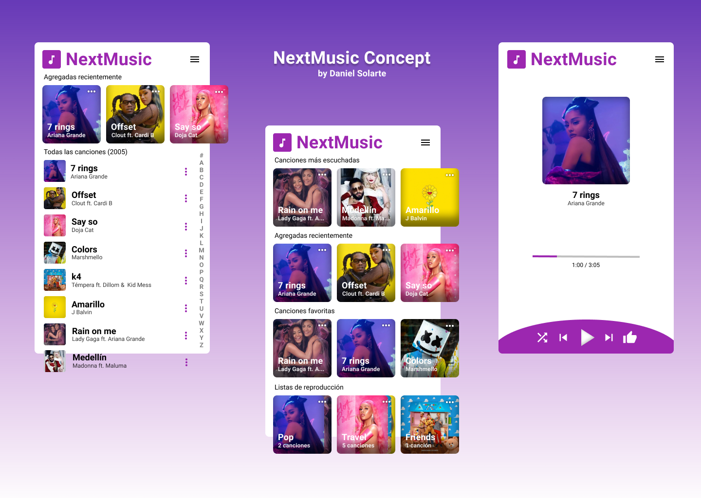

# NextMusic
Music Player application. (For now, the app is not working, only design)

## Technologies
* [Ionic](https://ionicframework.com/)
* [ReactJS](https://reactjs.org/)
* [SASS](https://sass-lang.com/)

## Design

## Getting started
Fist, you need clone this repository and then run `npm install` to install all dependencies. For build the source code run `npm run build` after install the dependencies.

### [Developing for Android](https://ionicframework.com/docs/developing/android)

### [Developing for iOS (Not tested)](https://ionicframework.com/docs/developing/ios)

## [License](./LICENSE)

## Contributors
* **Daniel Solarte** [GitHub](https://github.com/danielsolartech)
